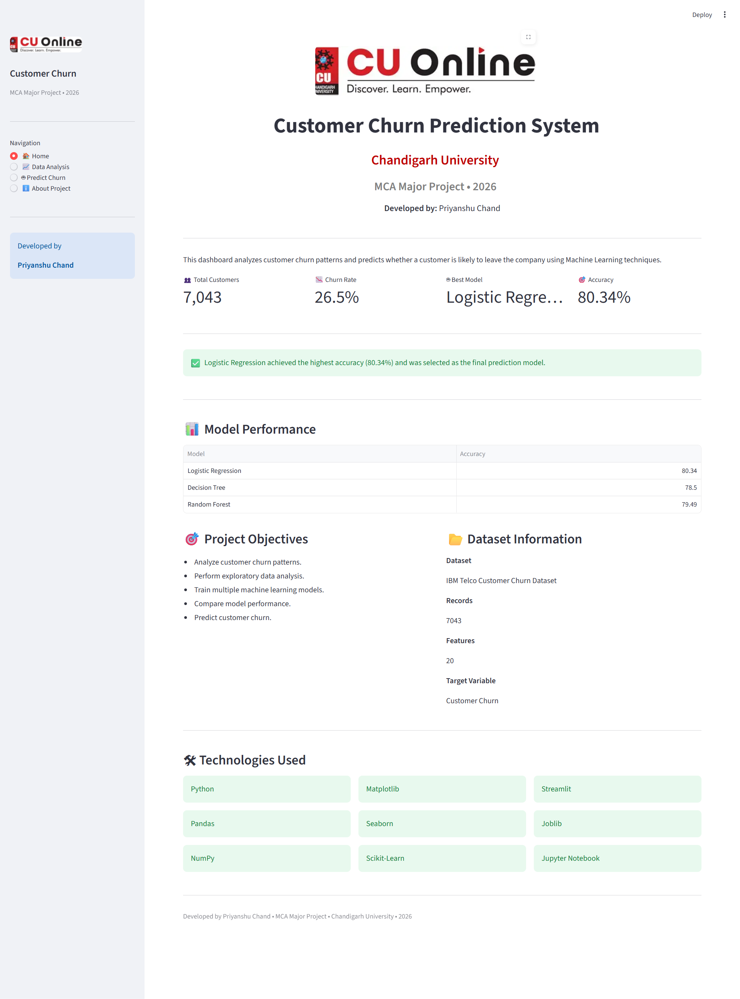
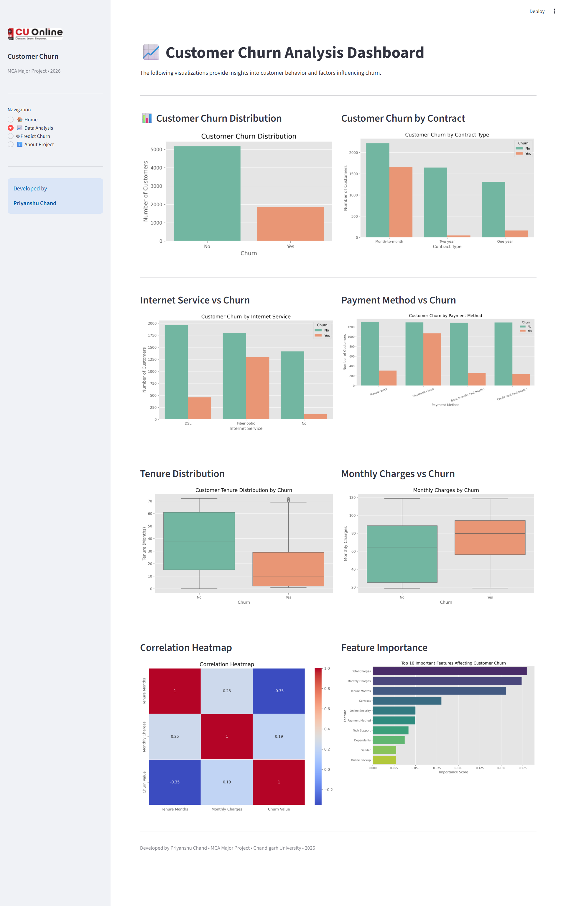
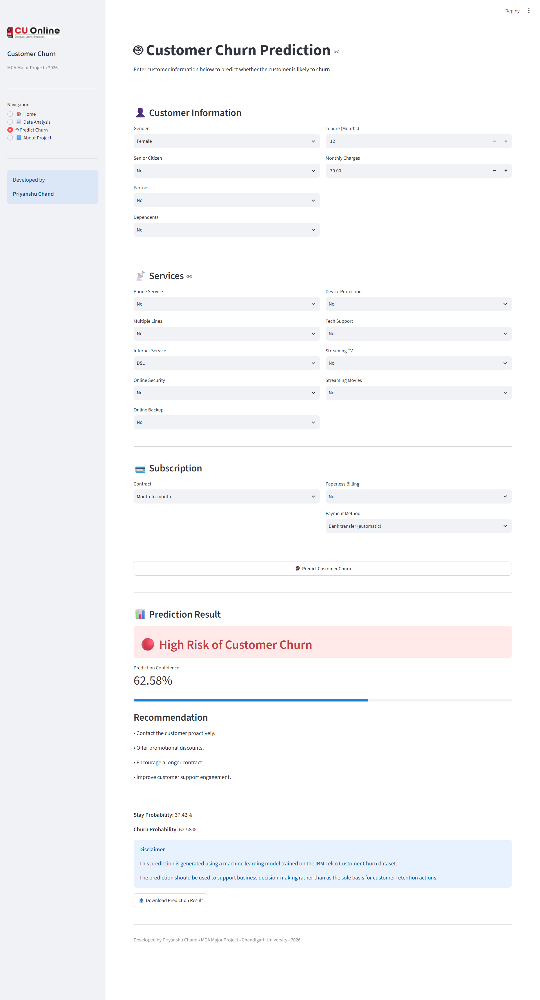
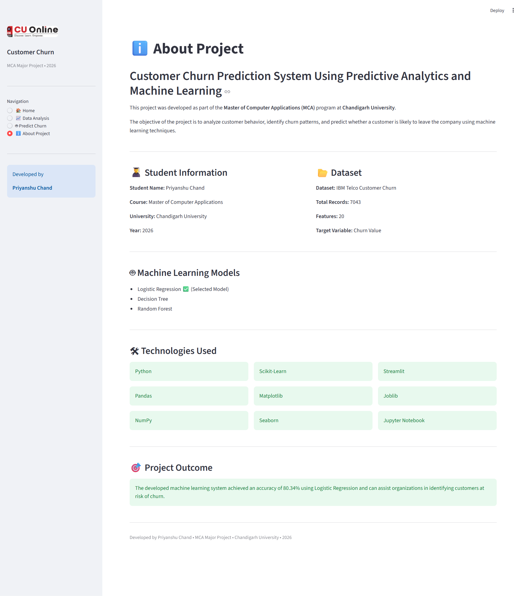

# 📊 Customer Churn Prediction System Using Predictive Analytics and Machine Learning

A machine learning web application developed using **Python**, **Scikit-Learn**, and **Streamlit** to predict customer churn based on customer demographics, subscription details, and service usage.

This project was developed as the **Major Project** for the **Master of Computer Applications (MCA)** program at **Chandigarh University**.

---

## 📌 Project Objectives

- Analyze customer churn patterns using exploratory data analysis.
- Identify factors influencing customer churn.
- Build and compare multiple machine learning models.
- Predict customer churn using the best-performing model.
- Provide an interactive dashboard for visualization and prediction.

---

## ✨ Features

- 📊 Interactive Streamlit Dashboard
- 📈 Exploratory Data Analysis (EDA)
- 🤖 Customer Churn Prediction
- 📉 Model Performance Comparison
- 📥 Download Prediction Results
- 📋 Project Information Page

---

## 🛠️ Technologies Used

- Python
- Pandas
- NumPy
- Matplotlib
- Seaborn
- Scikit-Learn
- Streamlit
- Joblib
- OpenPyXL

---

## 🤖 Machine Learning Models

The following classification algorithms were trained and evaluated:

- Logistic Regression ✅ (Selected Model)
- Decision Tree
- Random Forest

**Best Model:** Logistic Regression

**Accuracy:** 80.34%

---

## 📂 Project Structure

```text
customer-churn-prediction-system/
│
├── assets/
├── data/
│   ├── raw/
│   └── cleaned/
├── images/
├── models/
├── notebooks/
├── reports/
├── .gitignore
├── LICENSE
├── README.md
├── requirements.txt
└── streamlit_app.py
```

---

## 📊 Dataset

**Dataset:** IBM Telco Customer Churn Dataset

The dataset contains customer demographic information, subscription details, service usage, billing information, and churn status.

---

## 🚀 Installation

Clone the repository:

```bash
git clone https://github.com/PriyanshuChand/customer-churn-prediction-system.git
```

Install the required packages:

```bash
pip install -r requirements.txt
```

Run the Streamlit application:

```bash
python -m streamlit run streamlit_app.py
```

---

## 📸 Application Screenshots

### Home Page



### Data Analysis



### Predict Churn



### About Project



---

## 📈 Future Improvements

- Deploy the application online using Streamlit Community Cloud.
- Improve prediction accuracy using advanced machine learning models.
- Add deep learning-based prediction.
- Integrate a real-time customer database.
- Add user authentication and login.

---

## 👨‍💻 Author

**Priyanshu Chand**

Master of Computer Applications (MCA)

Chandigarh University

2026

---

## 📜 License

This project is licensed under the MIT License.